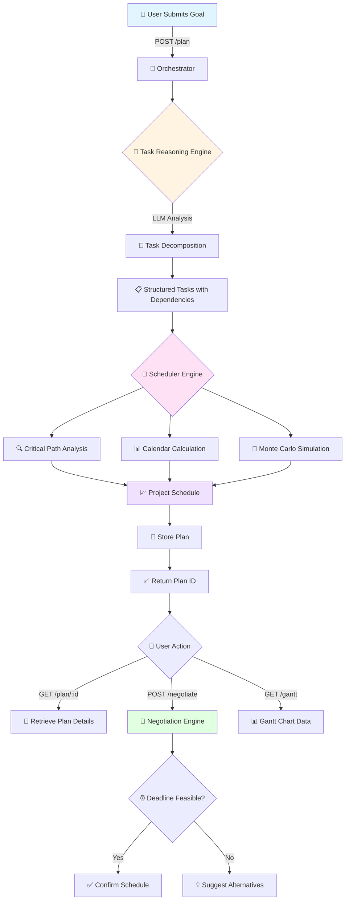

<div align="center">

# 🎯 Smart Task Planner

### AI-Powered Project Planning & Scheduling Engine

[](https://www.python.org/downloads/)
[](https://fastapi.tiangolo.com/)
[](LICENSE)
[]()

*Intelligent task decomposition, critical path analysis, and deadline negotiation powered by LLMs*

[Features](#-features) • [Quick Start](#-quick-start) • [API Documentation](#-api-endpoints) • [Architecture](#-architecture) • [Contributing](#-contributing)

</div>

---

## 📋 Table of Contents

- [Overview](#-overview)
- [Features](#-features)
- [System Architecture](#-system-architecture)
- [Workflow Diagram](#-workflow-diagram)
- [Installation](#-installation)
- [Quick Start](#-quick-start)
- [API Endpoints](#-api-endpoints)
- [Configuration](#-configuration)
- [Dependencies](#-dependencies)
- [Project Structure](#-project-structure)
- [Usage Examples](#-usage-examples)
- [Contributing](#-contributing)
- [License](#-license)
- [Author](#-author)

---

## 🌟 Overview

**Smart Task Planner** is an intelligent project planning system that leverages Large Language Models (LLMs) to automatically decompose complex goals into actionable tasks, perform critical path analysis, and negotiate realistic deadlines. It combines AI reasoning with traditional project management algorithms to deliver data-driven project schedules.

### Why Smart Task Planner?

- 🤖 **AI-Driven Task Breakdown**: Automatically decomposes goals into structured tasks with dependencies
- 📊 **Critical Path Analysis**: Identifies bottlenecks and critical tasks using CPM algorithms
- 🎲 **Monte Carlo Simulation**: Provides probabilistic project completion estimates
- 🤝 **Intelligent Negotiation**: AI-powered deadline negotiation with feasibility analysis
- 📅 **Smart Scheduling**: Respects weekends, holidays, and task dependencies
- 🔄 **RESTful API**: Easy integration with existing tools and workflows

---

## ✨ Features

| Feature | Description | Status |
|---------|-------------|--------|
| 🧠 **AI Task Reasoning** | LLM-powered task decomposition with rationale and risk analysis | ✅ Active |
| 📈 **CPM Scheduling** | Critical Path Method with slack time calculation | ✅ Active |
| 🎯 **Dependency Management** | Automatic task dependency resolution and validation | ✅ Active |
| 📊 **Monte Carlo Analysis** | Statistical project duration forecasting | ✅ Active |
| 🗓️ **Calendar Integration** | Weekend and holiday-aware scheduling | ✅ Active |
| 💬 **Deadline Negotiation** | AI-powered feasibility analysis and alternatives | ✅ Active |
| 📉 **Gantt Chart Data** | Export-ready Gantt chart visualization data | ✅ Active |
| 🔐 **Custom Logging** | Structured logging with error tracking | ✅ Active |

---

## 🏗️ System Architecture

```
┌─────────────────────────────────────────────────────────────┐
│                      FastAPI REST API                        │
│                     (app/main.py)                            │
└────────────────────┬────────────────────────────────────────┘
                     │
                     ▼
┌─────────────────────────────────────────────────────────────┐
│                    Orchestrator Layer                        │
│              (src/orchestrator.py)                           │
│  • Coordinates all components                                │
│  • Manages plan lifecycle                                    │
└──────┬──────────────┬──────────────┬────────────────────────┘
       │              │              │
       ▼              ▼              ▼
┌─────────────┐ ┌──────────────┐ ┌─────────────────────┐
│   Task      │ │  Scheduler   │ │   Negotiation       │
│  Reasoning  │ │   Engine     │ │     Engine          │
│             │ │              │ │                     │
│ • LLM-based │ │ • CPM        │ │ • Deadline          │
│   breakdown │ │ • Calendar   │ │   analysis          │
│ • Risk      │ │ • Monte      │ │ • Alternative       │
│   analysis  │ │   Carlo      │ │   suggestions       │
└─────────────┘ └──────────────┘ └─────────────────────┘
       │              │              │
       └──────────────┴──────────────┘
                     │
                     ▼
┌─────────────────────────────────────────────────────────────┐
│                   Utility Services                           │
│  • Config Loader  • Model Loader  • Custom Logger           │
└─────────────────────────────────────────────────────────────┘
```

---

## 🔄 Workflow Diagram



---

## 🚀 Installation

### Prerequisites

- Python 3.9 or higher
- pip package manager
- Virtual environment (recommended)

### Step-by-Step Setup

1. **Clone the repository**
   ```bash
   git clone https://github.com/yourusername/Smart-Task-Planner.git
   cd Smart-Task-Planner
   ```

2. **Create virtual environment**
   ```bash
   python -m venv smartTask
   ```

3. **Activate virtual environment**
   - Windows:
     ```bash
     smartTask\Scripts\activate
     ```
   - Unix/MacOS:
     ```bash
     source smartTask/bin/activate
     ```

4. **Install dependencies**
   ```bash
   pip install -r requirements.txt
   ```

5. **Configure environment variables**
   ```bash
   cp .env.example .env
   # Edit .env with your API keys
   ```

6. **Run the application**
   ```bash
   python app/main.py
   ```

The API will be available at `http://localhost:8000`

---

## ⚡ Quick Start

### Create Your First Plan

```python
import requests

# Create a new plan
response = requests.post("http://localhost:8000/plan", json={
    "goal": "Build a mobile app for task management",
    "constraints": "Team of 3 developers, limited to 60 days",
    "start_date": "2025-01-15",
    "weekend": [5, 6],
    "holidays": ["2025-01-26", "2025-03-14"]
})

plan = response.json()
print(f"Plan ID: {plan['plan_id']}")

# Retrieve plan details
plan_details = requests.get(f"http://localhost:8000/plan/{plan['plan_id']}")
print(plan_details.json())
```

---

## 📡 API Endpoints

### Core Endpoints

| Method | Endpoint | Description | Request Body | Response |
|--------|----------|-------------|--------------|----------|
| 🟢 POST | `/plan` | Create new project plan | `CreatePlanRequest` | `CreatePlanResponse` |
| 🔵 GET | `/plan/{plan_id}` | Retrieve plan details | - | Plan object with schedule |
| 🟡 POST | `/plan/{plan_id}/negotiate` | Negotiate deadline | `NegotiateRequest` | Negotiation result |
| 🟣 GET | `/plan/{plan_id}/gantt` | Get Gantt chart data | - | Gantt visualization data |

### Request/Response Models

#### CreatePlanRequest
```json
{
  "goal": "string (required)",
  "constraints": "string (optional)",
  "start_date": "YYYY-MM-DD (default: 2025-12-01)",
  "weekend": [5, 6],
  "holidays": ["YYYY-MM-DD"]
}
```

#### CreatePlanResponse
```json
{
  "plan_id": "uuid",
  "goal": "string",
  "constraints": "string"
}
```

#### NegotiateRequest
```json
{
  "deadline": "YYYY-MM-DD (optional)"
}
```

### Interactive API Documentation

Once the server is running, visit:
- **Swagger UI**: `http://localhost:8000/docs`
- **ReDoc**: `http://localhost:8000/redoc`

---

## ⚙️ Configuration

### Environment Variables

Create a `.env` file in the project root:

```env
# LLM Configuration
GROQ_API_KEY=your_groq_api_key_here
GOOGLE_API_KEY=your_google_api_key_here

# Model Selection
DEFAULT_MODEL=groq  # or google

# Logging
LOG_LEVEL=INFO
LOG_DIR=./logs

# API Configuration
API_HOST=0.0.0.0
API_PORT=8000
```

### config.yaml

Located in `config/config.yaml`:

```yaml
scheduler:
  default_weekend: [5, 6]  # Saturday, Sunday
  monte_carlo_iterations: 1000
  
task_reasoning:
  max_tasks: 50
  min_confidence: 0.6
  
negotiation:
  max_iterations: 3
  buffer_percentage: 0.15
```

---

## 📦 Dependencies

### Core Dependencies

| Package | Version | Purpose |
|---------|---------|---------|
| `fastapi` | Latest | Web framework for API |
| `uvicorn` | Latest | ASGI server |
| `pydantic` | Latest | Data validation |
| `langchain` | Latest | LLM orchestration |
| `langchain_groq` | Latest | Groq LLM integration |
| `langchain_google_genai` | Latest | Google Gemini integration |
| `python-dotenv` | Latest | Environment management |
| `pandas` | Latest | Data manipulation |
| `matplotlib` | Latest | Visualization |
| `structlog` | Latest | Structured logging |

### Installation

```bash
pip install -r requirements.txt
```

---

## 📁 Project Structure

```
Smart-Task-Planner/
│
├── 📂 app/
│   └── main.py                 # FastAPI application entry point
│
├── 📂 src/
│   ├── orchestrator.py         # Main orchestration logic
│   ├── task_reasoning.py       # LLM-based task decomposition
│   ├── scheduler.py            # CPM & Monte Carlo scheduling
│   └── negotiation_engine.py   # Deadline negotiation logic
│
├── 📂 model/
│   └── model.py                # Pydantic data models
│
├── 📂 utils/
│   ├── config_loader.py        # Configuration management
│   └── model_loader.py         # LLM model initialization
│
├── 📂 logger/
│   ├── __init__.py
│   └── customlogger.py         # Custom logging implementation
│
├── 📂 expection/
│   └── customExpection.py      # Custom exception classes
│
├── 📂 Prompt/
│   └── prompt_lib.py           # LLM prompt templates
│
├── 📂 config/
│   └── config.yaml             # Application configuration
│
├── 📂 logs/                    # Application logs
│
├── .env                        # Environment variables
├── .gitignore                  # Git ignore rules
├── requirements.txt            # Python dependencies
├── setup.py                    # Package setup
├── LICENSE                     # MIT License
└── README.md                   # This file
```

---

## 💡 Usage Examples

### Example 1: Software Development Project

```python
import requests

response = requests.post("http://localhost:8000/plan", json={
    "goal": "Develop a REST API for e-commerce platform",
    "constraints": "Must include authentication, payment gateway, and inventory management",
    "start_date": "2025-02-01",
    "weekend": [5, 6],
    "holidays": []
})

plan_id = response.json()["plan_id"]
```

### Example 2: Deadline Negotiation

```python
# Check if a specific deadline is feasible
negotiation = requests.post(
    f"http://localhost:8000/plan/{plan_id}/negotiate",
    json={"deadline": "2025-03-15"}
)

result = negotiation.json()
print(f"Feasible: {result['feasible']}")
print(f"Suggestions: {result['suggestions']}")
```

### Example 3: Gantt Chart Integration

```python
# Get Gantt chart data for visualization
gantt_data = requests.get(f"http://localhost:8000/plan/{plan_id}/gantt")
tasks = gantt_data.json()["tasks"]

# Use with your favorite Gantt library
for task in tasks:
    print(f"{task['name']}: {task['start']} → {task['end']}")
```

---

## 🤝 Contributing

Contributions are welcome! Please follow these steps:

1. 🍴 Fork the repository
2. 🌿 Create a feature branch (`git checkout -b feature/AmazingFeature`)
3. 💾 Commit your changes (`git commit -m 'Add some AmazingFeature'`)
4. 📤 Push to the branch (`git push origin feature/AmazingFeature`)
5. 🔃 Open a Pull Request

### Development Guidelines

- Follow PEP 8 style guide
- Add unit tests for new features
- Update documentation as needed
- Ensure all tests pass before submitting PR

---

## 📄 License

This project is licensed under the MIT License - see the [LICENSE](LICENSE) file for details.

---

## 👨‍💻 Author

**Mayuresh Bairagi**

- 📧 Email: [contact@example.com](mailto:contact@example.com)
- 💼 LinkedIn: [linkedin.com/in/mayuresh-bairagi](https://linkedin.com/in/mayuresh-bairagi)
- 🐙 GitHub: [@mayureshbairagi](https://github.com/mayureshbairagi)

---

## 🙏 Acknowledgments

- FastAPI for the excellent web framework
- LangChain for LLM orchestration capabilities
- The open-source community for inspiration and tools

---

## 📊 Project Status


---

<div align="center">

### ⭐ Star this repository if you find it helpful!

**Made with ❤️ and AI**

</div>
